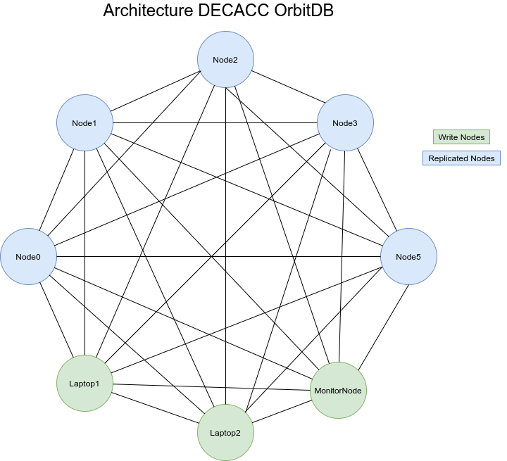

# CarbonCreditsBacklog

DECA's Carbon Credits OrbitDB Code and configs, everything you need for setting up a node.

**IMPORTANT: Please verify that the database address matches the smart contract address**

## Table of Contents

[[_TOC_]]


<p align="center">
  
</p>

## A Carbon Credit Structure (Example):

```sh
/*
  CC - Carbon credits
  Unix Time is date and time based in the UTC 0
  example for the first carbon credit that is 1365209
*/
[
  {
    //CCID: unique Carbon Credit Hash in DECAs registry (used as receipt and control)
    CCID: 'a67178fa3cb20e49f748050871f4f10784693bde1b9ec805740ff9c63b93860d', 
    SerialNo: 'GS1-1-MX-GS2441-16-2018-17438-328-328',
    ccAddress: 'https://registry.goldstandard.org/credit-blocks/details/107995', //Address GS Registry
    issueDate: 1552953600, // CC creation UnixTime
    cancelDate: 1587168000, // CC cancelation cancelation UnixTime
    ccCategory: 'Energy Efficiency - Domestic', // CC category agricultural
    ccStandard: 'GS', // CC standard GoldStandard Carbon Credit
    cancelPrice: { qty: '19.5', divisa: 'USD' },
    ccProjectID: 'GS2441', // CC project ID in the original backlog
    countryCode: 'MX', // Country code
    cancelRemaks: 'Cancel by account 1067262',
    ccVintageEnd: 1546214400, // CC what end date it was created in UnixTime
    ccMeasurement: 'VER(TCO2e)', //CC Measurement
    ccVintageStart: 1514764800, // CC what date year it was created in UnixTime
    conversionPrice: {
      BTC: 0.0027239430402556876,
      CNY: 137.92740063195478,
      ETH: 0.10952545708624091,
      EUR: 17.93351483640976,
      GBP: 15.588145399888809,
      LTC: 0.45310691929120134,
      USD: 19.5
    },
    CCAdquisitionRecipt: 'QmYw6JTNABDDfXvc3U2BfURjF5Zzx9eG3N43wJqHc4upDL' //Recipt of CC in IPFS
  }
]
```

## Requirements

* Node.js >= 12
* IPFS Daemon 0.4.23

## Installation

**Download and install Node.js v12.x and npm.**

* Node.js

> Using Ubuntu

```sh
  $ curl -sL https://deb.nodesource.com/setup_12.x | sudo -E bash -
  $ sudo apt-get install -y nodejs
```
> Using Debian, as root

```sh
 $ curl -sL https://deb.nodesource.com/setup_12.x | bash - 
 $ apt-get install -y nodejs
```

* IPFS Daemon

> Download and install go-ipfs v0.4.23 into your architecture 

```sh
 $ wget https://dist.ipfs.io/go-ipfs/v0.4.23/go-ipfs_v0.4.23_linux-amd64.tar.gz
 $ tar xvfz go-ipfs.tar.gz
 $ cd go-ipfs
 $ ./install.sh
```
**Note: In this example we use amd64(x86_64) architecture, for a diferent one go [here](https://dist.ipfs.io/go-ipfs/v0.4.23)** 

> Test

```sh
 $ ipfs help
```

> Init your node 

```sh
 $ ipfs init
```


> It is necessary to enable [circle relay](https://github.com/ipfs/js-ipfs/tree/master/examples/circuit-relaying) in the node to be able to replicate the database to react with js-ipfs for it is necessary to use the following configuration

```sh
 $ vim ~/.ipfs/config
   "Swarm": {
    "AddrFilters": null,
    "ConnMgr": {
      "GracePeriod": "20s",
      "HighWater": 900,
      "LowWater": 600,
      "Type": "basic"
    },
    "DisableBandwidthMetrics": false,
    "DisableNatPortMap": false,
    "DisableRelay": false,
    "EnableRelayHop": true
    }
```

>We also need to make sure our go node can be dialed from the browser. For that, we need to enable a transport that both the browser and the go node can communicate over. We will use the web sockets transport.

>To enable the transport and set the interface and port we need to edit the ~/.ipfs/config one more time. Let's find the Swarm array and add our desired address there.

```sh
 $ vim ~/.ipfs/config
  "Swarm": [
    "/ip4/0.0.0.0/tcp/4001",
    "/ip4/0.0.0.0/tcp/4004/ws",
    "/ip6/::/tcp/4001"
  ],

```


# [OrbitDB](https://github.com/orbitdb/orbit-db)

OrbitDB is a **serverless, distributed, peer-to-peer database**. OrbitDB uses [IPFS](https://ipfs.io) as its data storage and [IPFS Pubsub](https://github.com/ipfs/go-ipfs/blob/master/core/commands/pubsub.go#L23) to automatically sync databases with peers. It's an eventually consistent database that uses [CRDTs](https://en.wikipedia.org/wiki/Conflict-free_replicated_data_type) for conflict-free database merges making OrbitDB an excellent choice for decentralized apps (dApps), blockchain applications and offline-first web applications.

## Usage local 

**Clone the repo**

```sh
 $ git clone https://gitlab.com/deca-currency/carboncreditsbacklog.git
 $ cd carboncreditsbacklog
```

**Install the dependencies:**

```sh
 $ npm install 
```

### InterPlanetary File System (IPFS) Configs: 
**Start IPFS Daemon** (Note: pubsub-experiment is necesary to work with OrbitDB)

```sh
 $ ipfs daemon --enable-pubsub-experiment
```

> Configure ipfs as a service, set your self in the repository directory and do as follows: 

```sh
 $ sudo cp services/ipfs.service /etc/systemd/system/
```

> Modify user and path to ipfs so that it matches with your system and user that runs ipfs: 

```sh
 $ sudo vim /etc/systemd/system/ipfs.service

[Unit]
Description=IPFS Daemon

[Service]
ExecStart=/usr/local/bin/ipfs daemon --enable-pubsub-experiment
User=nodemaster
Restart=always
LimitNOFILE=10240

[Install]
WantedBy=multi-user.target
```
**NOTE: in this example user that runs ipfs and orbitdb instance is nodemaster, also the ipfs location is at /usr/local/bin/ipfs**

> Enable the service

```sh
 $ sudo systemctl daemon-reload
 $ sudo systemctl enable ipfs.service
 $ sudo systemctl start ipfs.service
 $ sudo systemctl status ipfs.service
```
**NOTE: service must be set as active (running), if not please verify the preview steps**


**Start the DecaCC Interface**

```sh
 $ node interfaz.js
```

**Note: With this you can use OrbitDB but only in your local node**

## Usage with replication (optional)

You need to do all the past steps.

Run index.js with uncomment line 24, 25, the first log is your orbitdb address (See the Wiki for more information), the second is your orbitDB address database copy this address and pass in index.js in line 6, and in interfaz.js in the same line.

**If you want to debug orbitdb in bash**

```sh
 $ export LOG="orbit*" node
```

**Start the DecaCC replicated**

```sh
 $ node index.js
```

Later in the nodes that will work like peers only, install the requeriments and run index.js with the new address.


**Start the DecaCC Interface**

```sh
 $ node interfaz.js
```

In the node that can write run interfaz.js and choose an option.

```sh
 $ Show Carbon Credit records
 $ Insert Carbon credit      
 $ Delete Carbon credit      
 $ Exit 
```

**Note: If the nodes will replicated you need connect before with IPFS Daemon (See Wiki).**

*Note 2: Remember dont lost your orbitdb folder because your identity.id change and cant write in a database another time*

## Connect Nodes

In order to connect nodes, we create a bash script which resolves the domain name of each node and ipfs swarms them,
this script should be configured in a crontab to run every 5 minutes. The crontab should be configured as the user
that holds this repository and that runs the orbitdb.

*Open the crontab as the user that holds the script*
```sh
 $ crontab -e
```
*Append the following line at the end of the editor and write it*

```sh
0,5,10,15,20,25,30,35,40,45,50,55 * * * * sleep 28 ; /home/nodemaster/carboncreditsbacklog/connectNodes.sh >> /tmp/NodeStatus.log  2>&1 &
```
**NOTE: in this example the path is nodemaster user directory, you should change it with your username and the path to the script connectNodes.sh**

*Finally verify the logs at /tmp/NodeStatus.log to verify that it is working, this should look similar to this:*
```sh
$ cat /tmp/NodeStatus.log

Error: connect Qmd4Cv2fNwixP6cabEnTVFkF57GUGD6VBEcDhUkqHPG4X9 failure: dial to self attempted
connect QmdcWqBmvAvdNY2gq14LTP6rAgSQAe1cBvnpwqWrJy8S2Y success
connect QmfBASmqe3Az9AUjCxx3dtomSmbZEiJCsXusPxznjNnjU5 success
connect QmPbDkCpSE9uQuiXTBnoWjnzRESpSe9p8P1de12nExA4fY success
connect QmQBAsbA49q7QrKhetJpbo5gKxQQiL6sxVXCep5skmuHsq success
connect QmZL1otpiCzWMEJTHXbQ5Hb4aFE7TKLjAuuBAAet1WAgtD success
```
**NOTE: it is possible that you won't connect at the first try with most of the nodes, so you can wait for 10 or 15 minutes to verify again**

## For Public NODES updater as service

### This is in case you want to have a node that is just for public access and constantly replicating the last data in orbit DB

> Configure public nodes updater service, set your self in the repository directory and do as follows: 

```sh
 $ sudo cp services/publicNode.service /etc/systemd/system/
```

> Modify user and path to node and the repository so that it matches with your system and user that runs ipfs and node: 

```sh
 $ sudo vim /etc/systemd/system/publicNode.service 
 
[Unit]
Description=Public Node Updater

[Service]
WorkingDirectory=/home/nodemaster/carboncreditsbacklog/
ExecStart=/usr/local/bin/node /home/nodemaster/carboncreditsbacklog/index.js
User=nodemaster
Restart=always
LimitNOFILE=10240

[Install]
WantedBy=multi-user.target

```
**NOTE: in this example user that runs ipfs, node and orbitdb instance is nodemaster, also the node location is at /usr/local/bin/node**

**NOTE1: set WorkingDirectory where is the repository, for this example /home/nodemaster/carboncreditsbacklog/**

**NOTE2: set where is index.js mostly in the repository as follow path to node path, for this example /home/nodemaster/carboncreditsbacklog/index.js**

> Enable the service

```sh
 $ sudo systemctl daemon-reload
 $ sudo systemctl enable publicNode.service 
 $ sudo systemctl start publicNode.service 
 $ sudo systemctl status publicNode.service 
```
**NOTE: service must be set as active (running), if not please verify the preview steps**

# Configure WebSocket on IPFS

You can help us to increase the speed of replication of the database at react [DECA Carbon Credits](http://search.deca.green/). To do this, once the node is configured as a service and the database is replicated, it is necessary to enable the connection through WebSocket Secure to do so in order to have a DNS.

### Requirements

* Nginx >= 1.14.0
* Certbot >= 1.6

Install Nginx 

```sh
   $ sudo apt update
   $ sudo apt install nginx
``` 

Install Certbot

```sh
   $ sudo add-apt-repository ppa:certbot/certbot
   $ sudo apt update
   $ sudo apt install python-certbot-nginx
```


> In a nginx configuration add the proxy pass to the websocket. 

```sh
 $ vim /etc/nginx/conf.d/example.com.conf
server {
    listen         80 default_server;
    listen         [::]:80 default_server;
    server_name    example.com www.example.com;
    root           /var/www/example.com;
    index          index.html;
    try_files $uri /index.html;
    location /  {
        proxy_pass http://localhost:4004;
        proxy_http_version 1.1;
        proxy_set_header Upgrade $http_upgrade;
        proxy_set_header Connection 'upgrade';
        proxy_set_header Host $host;
        proxy_cache_bypass $http_upgrade;
    }
}
```

### Add SSL Certificate

**This is necessary because otherwise the web browser will not be able to connect to the WebSocket**

```sh
 $ sudo certbot --nginx -d example.com
```


Finally renew the certificate with the following command and restart nginx

```sh
$ sudo certbot renew --dry-run
$ sudo service nginx restart
```

**Remember to open the port in the firewall**

**Now restart up Nginx!**


# IPFS pin projects receipt

**You can help us by pinning  DECA's project receipts into IPFS which will give deeper trust to DECA.**

We have a script in order to pin (replicate into your node) the projects receipts that DECA got, so that
any one can have a proof that we bought this receipts as public information. Also you can store a copy of this receipts which will be added by IPFS hash into this script. 

> run the IPFS pin script

```sh
 $ /receipts.sh 
connect Qmd4Cv2fNwixP6cabEnTVFkF57GUGD6VBEcDhUkqHPG4X9 success
connect QmfBASmqe3Az9AUjCxx3dtomSmbZEiJCsXusPxznjNnjU5 success
connect QmQBAsbA49q7QrKhetJpbo5gKxQQiL6sxVXCep5skmuHsq success
connect QmZL1otpiCzWMEJTHXbQ5Hb4aFE7TKLjAuuBAAet1WAgtD success

IPFS PIN DECA's Carbon Credits Receipts?:
Enter Y for Yes, N for No:Y
Pinning Receipts by IPFS hash
pinned QmYw6JTNABDDfXvc3U2BfURjF5Zzx9eG3N43wJqHc4upDL recursively

IPFS GET(Download) DECA's Carbon Credits Receipts?:
Enter Y for Yes, N for No:Y
Getting Receipts by IPFS hash
Default receipts file is ./receipts...
Saving file(s) to ./proyectsReceipts
 135.34 KiB / 135.34 KiB [======================================================================================================================================] 100.00% 0s
Bye ;) 

$ ls proyectsReceipts 
QmYw6JTNABDDfXvc3U2BfURjF5Zzx9eG3N43wJqHc4upDL
```

As you can see in the above example we pin the receipt by running " ./receipts.sh ", also we Download this receipt with should be allocated in the directory projects Receipts.

***
# License

[**GPLV3**](./LICENSE).

# Information and contacts.
***Gitter***
https://gitter.im/deca-currency/community

***Developers***
- Jose [jose@deca.eco](mailto:jose@deca.eco)
- David [david@deca.eco](mailto:david@deca.eco)

## ToDo
 - Update OrbitDB with IPFS 5.0 support
 - Update to IPFS 5.0
 - Create a LXC or a Docker.

## References:

[**OrbitDB**](https://youtu.be/CjYKrbq8BCw)

[**SSL in the Server**](http://werkzeug.pocoo.org/docs/0.14/serving/)

[**SSL in Client**](http://steven.casagrande.io/articles/python-requests-and-ssl/)
